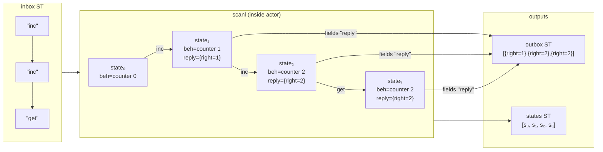
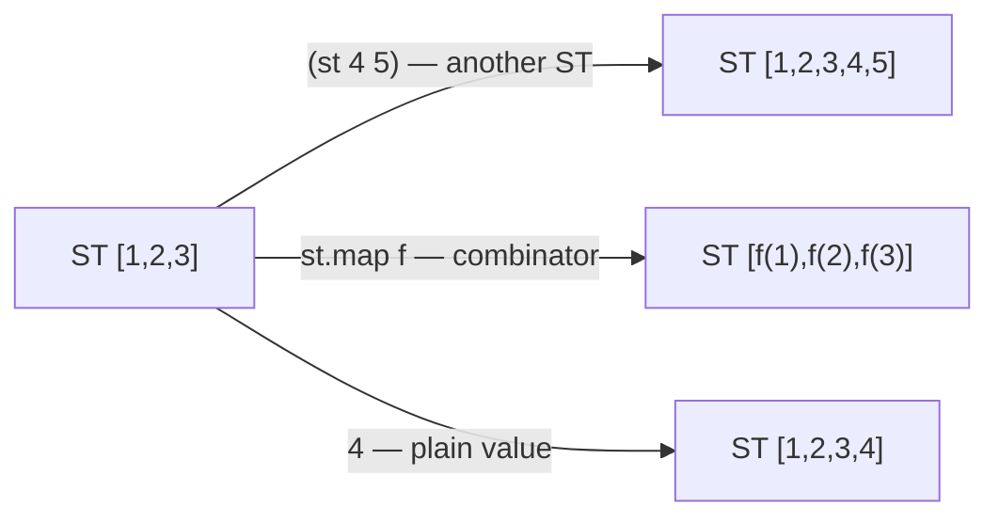

import { Aside } from '@astrojs/starlight/components';

## The actor model (briefly)

The actor model is a way of structuring programs around independent units of computation — **actors** — that communicate by passing messages. Each actor:

- has its own private state
- receives messages one at a time from its inbox
- replies to each message (or doesn't)
- can change its behaviour for the next message

In most actor frameworks (Erlang, Akka, etc.) actors run concurrently and communicate across process boundaries. dnzl is different: actors are **pure Nix functions**. There is no concurrency, no IO, no scheduler. Evaluation is Nix evaluation — lazy and deterministic.

## What is a behaviour?

A **behaviour** is a plain Nix function from message to response attrset:

```nix
# Stateless behaviour — no state argument, same response every time
echo = msg: reply msg;

# Stateful behaviour — curried: state is the first argument
counter =
  count: msg:
  if msg == "inc" then
    reply.right (count + 1) // become (counter (count + 1))
  else if msg == "get" then
    reply.right count
  else
    { };   # unknown message → no reply, behaviour unchanged
```

A behaviour knows nothing about dnzl internals. It's just a function. The fields it can return:

| Field | Effect |
|---|---|
| `reply` | Value placed in `outbox`. Can be a plain value or a `ST` stream. |
| `next-behaviour` | Replaces the current behaviour for the next message. |
| Any other field | Passes through to `states`. Accessible as a side-channel. |

Returning `{ }` (empty attrset) means: produce no output, keep current behaviour. This is how unknown messages are silently dropped.

<Aside type="note" title="See it in tests">
[`tests/examples.nix` — `stateful.test-counter`](https://github.com/denful/dnzl/blob/main/tests/examples.nix), [`stateful.test-unknown-drops`](https://github.com/denful/dnzl/blob/main/tests/examples.nix)
</Aside>

## What is an actor?

`actor` wraps a behaviour into a **cycle-c** — a function from `{ inbox }` to `{ outbox, states }`:

```nix
counter-c = actor (counter 0);

result = counter-c { inbox = st "inc" "inc" "get"; };
result.outbox.toList
# → [ { right = 1; } { right = 2; } { right = 2; } ]
```

Internally, `actor` runs `scanl` (a running fold) over the inbox stream. It threads `{ behaviour }` state across messages. After each message, `reply` fields are extracted into `outbox`.



`states` has N+1 entries for N messages (initial state + one per message). `outbox` has at most N entries — only messages that returned a `reply` field.

<Aside type="note" title="See it in tests">
[`tests/actor.nix` — `test-counter`](https://github.com/denful/dnzl/blob/main/tests/actor.nix), [`test-become`](https://github.com/denful/dnzl/blob/main/tests/actor.nix), [`test-unknown-drops`](https://github.com/denful/dnzl/blob/main/tests/actor.nix)
</Aside>

## ST: the stream type

`ST` is a lazy stream monad from `ned`. You create streams with `st`:

```nix
s = st 1 2 3;
s.toList        # → [ 1 2 3 ]
```

Streams are **functors** — you can call a stream as a function to transform it:



| Argument type | Result |
|---|---|
| Another `ST` | Concatenate (append the second after the first) |
| No-arg function (combinator) | Apply combinator in-place |
| Any plain value | Append singleton |

```nix
(st 1 2 3) (st 4 5)              # → ST [1 2 3 4 5]
(st 1 2 3) (st.map (x: x * 2))  # → ST [2 4 6]
(st 1 2 3) 4                     # → ST [1 2 3 4]
```

This functor dispatch is how actors wire together: pass one actor's `outbox` as another's `inbox`, optionally transforming it first.

<Aside type="note" title="See it in tests">
[`tests/patterns.nix` — `st-combinators.test-map-combinator`](https://github.com/denful/dnzl/blob/main/tests/patterns.nix), [`st-combinators.test-filter-combinator`](https://github.com/denful/dnzl/blob/main/tests/patterns.nix)
</Aside>

## Inbox and outbox

An actor's **inbox** is a `ST` of messages. Its **outbox** is a `ST` of reply values — one per message that produced a `reply` field.

Messages returning `{ }` produce no outbox entry — they're silently dropped:

```nix
counter-beh = count: msg:
  if msg == "inc" then { reply = count + 1; next-behaviour = ...; }
  else { };   # no reply field → no outbox entry

(actor (counter-beh 0) { inbox = st "inc" "???"; }).outbox.toList
# → [ 1 ]   — "???" is dropped, no outbox entry
```

Reply values can themselves be streams. `states.fields "reply"` flattens them, so one message can produce multiple outbox entries:

```nix
expander = msg: { reply = st.fromList msg.items; };
expander-c = actor expander;

result = expander-c {
  inbox = st { items = [ 10 20 30 ]; };
};
result.outbox.toList
# → [ 10 20 30 ]
```

<Aside type="note" title="See it in tests">
[`tests/examples.nix` — `fan-out.test-expander`](https://github.com/denful/dnzl/blob/main/tests/examples.nix), [`fan-out.test-multiple-envelopes`](https://github.com/denful/dnzl/blob/main/tests/examples.nix)
</Aside>

## States: side-channel outputs

`actor` also returns `states` — the full `scanl` output including the initial state (N messages → N+1 states). Behaviours can set extra fields beyond `reply`:

```nix
logged-div =
  msg:
  if msg.divisor == 0 then
    reply.left "div-by-zero"
    // { log = "WARN: div-by-zero dividend=${toString msg.dividend}"; }
  else
    reply.right (msg.dividend / msg.divisor)
    // { log = "OK: ${toString msg.dividend}/${toString msg.divisor}=${toString (msg.dividend / msg.divisor)}"; };

a = (actor logged-div) {
  inbox = st
    { dividend = 10; divisor = 2; }
    { dividend = 6;  divisor = 0; };
};

a.outbox.toList                    # → [ { right = 5; } { left = "div-by-zero"; } ]
(a.states.fields "log").toList     # → [ "OK: 10/2=5" "WARN: div-by-zero dividend=6" ]

# states has N+1 entries (initial state + one per message)
builtins.length a.states.toList    # → 3
```

`states.fields "key"` extracts one field from each state into a `ST`, flattening any nested streams.

<Aside type="note" title="See it in tests">
[`tests/examples.nix` — `extra-outputs.test-audit-log`](https://github.com/denful/dnzl/blob/main/tests/examples.nix), [`extra-outputs.test-states-accessible`](https://github.com/denful/dnzl/blob/main/tests/examples.nix)
</Aside>
