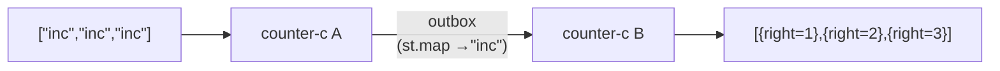
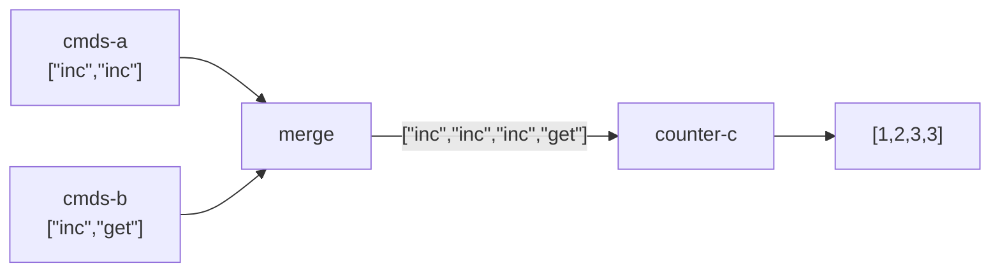
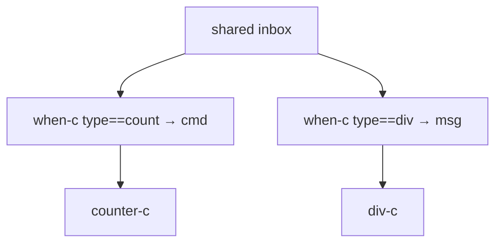
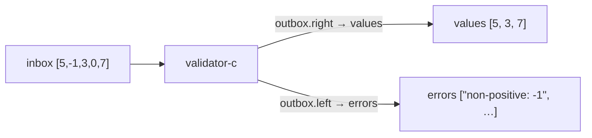

import { Aside } from '@astrojs/starlight/components';

## Outbox → inbox wiring

Wire one actor's outbox as the next actor's inbox. Nix laziness resolves evaluation order.

```nix
a = counter-c { inbox = st "inc" "inc" "inc"; };
# a.outbox = ST [{ right = 1 } { right = 2 } { right = 3 }]

# Map each reply to "inc" and feed to the next counter
b = counter-c { inbox = a.outbox (st.map (_: "inc")); };
b.outbox.toList
# → [ { right = 1; } { right = 2; } { right = 3; } ]
```

`a.outbox` is a `ST`. Calling it with a combinator transforms it in place.



<Aside type="note" title="See it in tests">
[`tests/examples.nix` — `pipeline.test-counter-chain`](https://github.com/denful/dnzl/blob/main/tests/examples.nix), [`tests/patterns.nix` — `ping-pong.test-three-stage-lazy`](https://github.com/denful/dnzl/blob/main/tests/patterns.nix)
</Aside>

## merge — fan-in

`merge` concatenates a list of streams sequentially:

```nix
merge [ (st "a" "b") (st "c" "d") ]
# → ST ["a" "b" "c" "d"]
```

Feed multiple upstream outboxes into one actor:

```nix
cmds-a = st "inc" "inc";
cmds-b = st "inc" "get";

shared = counter-c { inbox = merge [ cmds-a cmds-b ]; };
shared.outbox.toList
# → [ { right = 1; } { right = 2; } { right = 3; } { right = 3; } ]
```



<Aside type="note" title="See it in tests">
[`tests/examples.nix` — `fan-in.test-merge-two`](https://github.com/denful/dnzl/blob/main/tests/examples.nix), [`fan-in.test-merge-three`](https://github.com/denful/dnzl/blob/main/tests/examples.nix), [`fan-in.test-shared-counter`](https://github.com/denful/dnzl/blob/main/tests/examples.nix)
</Aside>

## send — forward to a ref

`send ref msgs` calls `ref { inbox = msgs }` and returns `{ reply = ref_outbox }`. Each call creates a fresh actor session.

```nix
# Each message is routed to a fresh counter
proxy = msg: send counter-c (st msg);
proxy-c = actor proxy;

(proxy-c { inbox = st "inc" "inc" "get"; }).outbox.toList
# → [ { right = 1; } { right = 1; } { right = 0; } ]
# Each "inc" and "get" goes to its own fresh counter — no shared state
```

<Aside type="note" title="See it in tests">
[`tests/examples.nix` — `delegation.test-fresh-per-message`](https://github.com/denful/dnzl/blob/main/tests/examples.nix), [`delegation.test-batch-send`](https://github.com/denful/dnzl/blob/main/tests/examples.nix)
</Aside>

## when-c — content-based routing

`when-c pred inbox f` filters `inbox` to messages where `pred` holds, then maps with `f`:

```nix
inbox =
  st
    { type = "count"; cmd = "inc"; }
    { type = "div"; dividend = 10; divisor = 2; }
    { type = "count"; cmd = "inc"; }
    { type = "count"; cmd = "get"; };

counts  = counter-c { inbox = when-c (m: m.type == "count") inbox (m: m.cmd); };
divides = div-c     { inbox = when-c (m: m.type == "div")   inbox (m: m);     };
```

Each actor sees only its slice. The shared `inbox` is never mutated.



<Aside type="note" title="See it in tests">
[`tests/examples.nix` — `routing.test-type-routing`](https://github.com/denful/dnzl/blob/main/tests/examples.nix), [`tests/advanced.nix` — `isolated-sessions.test-two-clients-independent-state`](https://github.com/denful/dnzl/blob/main/tests/advanced.nix)
</Aside>

## Multi-output cycles

A cycle-c can return any attrset — not just `{ outbox }`:

```nix
validate-c =
  { inbox }:
  let a = validator-c { inherit inbox; };
  in {
    values = a.outbox.right;
    errors = a.outbox.left;
  };

result = validate-c { inbox = st 5 (-1) 3 0 7; };
result.values.toList
# → [ 5 3 7 ]
result.errors.toList
# → [ "non-positive: -1" "non-positive: 0" ]
```



<Aside type="note" title="See it in tests">
[`tests/patterns.nix` — `multi-output-cycle.test-named-outputs`](https://github.com/denful/dnzl/blob/main/tests/patterns.nix)
</Aside>

## Inbox concat

Streams concatenate via the functor: `stream-a (stream-b)`. Use this to extend an inbox:

```nix
# External commands first, then two bootstrap "inc" appended
bootstrapped-c =
  { inbox }:
  counter-c { inbox = merge [ inbox (st "inc" "inc") ]; };

result = bootstrapped-c { inbox = st "inc"; };
result.outbox.toList
# → [ { right = 1; } { right = 2; } { right = 3; } ]
```

<Aside type="note" title="See it in tests">
[`tests/patterns.nix` — `multi-sender.test-extend-with-static`](https://github.com/denful/dnzl/blob/main/tests/patterns.nix), [`inbox-concat.test-concat-inbox-with-output`](https://github.com/denful/dnzl/blob/main/tests/patterns.nix)
</Aside>
