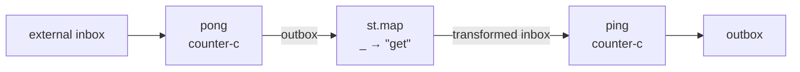
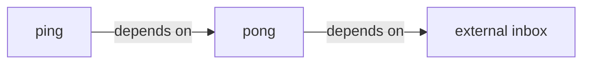
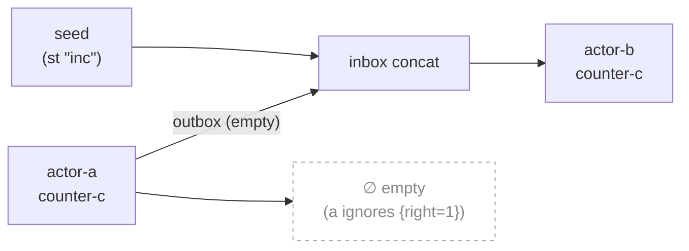

import { Aside } from '@astrojs/starlight/components';

## Nix laziness as the runtime

dnzl has no runtime. Evaluation is Nix evaluation. Nix is lazy: expressions are computed on demand, and `let` bindings are not evaluated until their values are needed.

This means you can write actor wiring that appears circular — as long as there is no actual data-flow cycle, Nix resolves the order automatically.

## Ping-pong via lazy let

The canonical example: `pong` processes the external seed; `ping` reads pong's output transformed into queries.



Dependency graph — acyclic, Nix resolves automatically:



```nix
ping-pong-c =
  { inbox }:
  let
    pong = counter-c { inherit inbox; };
    ping = counter-c { inbox = pong.outbox (st.map (_: "get")); };
  in
  { outbox = ping.outbox; };
```

`ping` references `pong.outbox`, but `pong` does not reference `ping`. Nix resolves `pong` first because `ping` depends on it. No explicit ordering is needed.

<Aside type="note" title="See it in tests">
[`tests/patterns.nix` — `ping-pong.test-pong-feeds-ping`](https://github.com/denful/dnzl/blob/main/tests/patterns.nix), [`ping-pong.test-three-stage-lazy`](https://github.com/denful/dnzl/blob/main/tests/patterns.nix)
</Aside>

## Three-stage lazy pipeline

Extend the pattern to N stages:

```nix
stage-a = counter-c { inbox = st "inc" "inc" "inc"; };
stage-b = counter-c { inbox = stage-a.outbox (st.map (_: "inc")); };
stage-c = counter-c { inbox = stage-b.outbox (st.map (_: "get")); };
```

Each stage depends only on the previous one. Nix evaluates them in dependency order without any manual sequencing.

<Aside type="note" title="See it in tests">
[`tests/patterns.nix` — `ping-pong.test-three-stage-lazy`](https://github.com/denful/dnzl/blob/main/tests/patterns.nix)
</Aside>

## Feedback and termination

A feedback loop is an actor whose inbox includes its own output. As long as the output is eventually empty, the loop terminates:



```nix
a = counter-c { inbox = st { right = 1; }; };  # unknown msg → no reply
b = counter-c { inbox = (st "inc") (a.outbox); };
# a produces no output → b only sees the seed "inc"
```

`counter` ignores `{ right = n }` messages (returns `{ }`), so `a.outbox` is empty. `b`'s inbox is just `(st "inc")` — one message, one reply.

<Aside type="note" title="See it in tests">
[`tests/patterns.nix` — `inbox-concat.test-run-feedback-terminates`](https://github.com/denful/dnzl/blob/main/tests/patterns.nix)
</Aside>

## What this enables

- **No explicit scheduling**: actors are just functions, evaluation order falls out of data dependency
- **No deadlock**: there are no blocking operations, everything is a pure expression
- **No shared mutable state**: `become` threads state through `scanl`, which is a fold — no mutation
- **Infinite streams**: `ST` is lazy; actors can conceptually process infinite streams, Nix evaluates only as much as needed

## Limitations

Since Nix is a purely functional language without recursion between `let` bindings at runtime, a **true** circular data dependency would cause an infinite loop. dnzl's design avoids this: `send` always creates a fresh actor session (no shared state back-channel), and `merge` concatenates streams rather than interleaving them dynamically.

If you write a loop where actor A's outbox feeds A's own inbox without a termination condition, Nix will not evaluate it — it will diverge. Design your feedback loops to always terminate (empty output → empty feedback).
