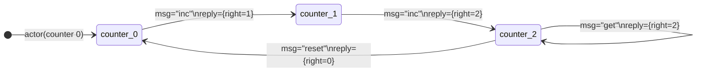
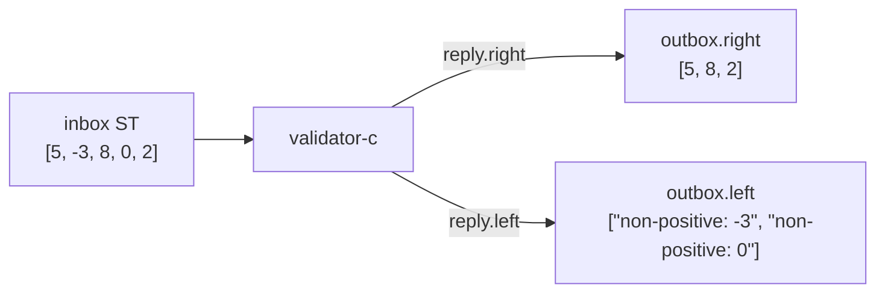
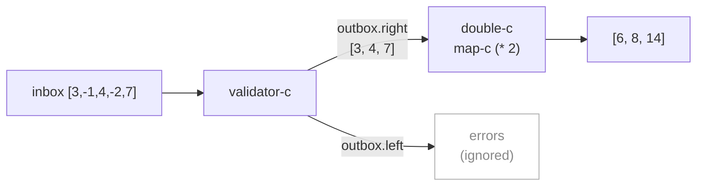

import { Aside } from '@astrojs/starlight/components';

## reply

`reply` constructs the `reply` field in a behaviour's return attrset:

```nix
reply 42          # { reply = 42; }
reply.right 42    # { reply = { right = 42; }; }
reply.left "err"  # { reply = { left = "err"; }; }
```

`reply` is an attrset with `__functor`, so it works both as a function and as a namespace. You can also write `{ reply = value; }` directly — `reply` is sugar.

```nix
reply data         # plain value in outbox
reply.right data   # tagged success
reply.left  data   # tagged failure
```

<Aside type="note" title="See it in tests">
[`tests/examples.nix` — `reply-types.test-plain`](https://github.com/denful/dnzl/blob/main/tests/examples.nix), [`reply-types.test-right-and-left`](https://github.com/denful/dnzl/blob/main/tests/examples.nix)
</Aside>

## become

`become` returns `{ next-behaviour = new-beh }`, telling the actor to use `new-beh` for the next message:

```nix
become new-beh   # { next-behaviour = new-beh; }
```

Combine with `reply` using `//`:

```nix
counter =
  count: msg:
  if msg == "inc" then
    reply.right (count + 1) // become (counter (count + 1))
  else if msg == "get" then
    reply.right count
  else if msg == "reset" then
    reply.right 0 // become (counter 0)
  else
    { };
```

Without `become`, every message sees the initial behaviour. With `become`, state threads through as a function closure — no mutable variables.

<Aside type="note" title="See it in tests">
[`tests/actor.nix` — `test-become`](https://github.com/denful/dnzl/blob/main/tests/actor.nix), [`tests/examples.nix` — `stateful.test-counter`](https://github.com/denful/dnzl/blob/main/tests/examples.nix), [`stateful.test-reset`](https://github.com/denful/dnzl/blob/main/tests/examples.nix)
</Aside>

## How become works



Each `become` installs the next function reference as the behaviour. The count is closed over — the function IS the state.

## Stateless actors

For pure transformations with no state, `map-c` is more direct than `actor`:

```nix
inherit (dnzl.ned) map-c;

echo-c   = map-c (x: x);         # identity
double-c = map-c (n: n * 2);     # scale

# map-c returns a stream transformer — call it on a stream directly
(double-c (st 1 2 3)).toList
# → [ 2 4 6 ]
```

`actor` works too, but `map-c` is the idiomatic form for stateless transforms.

<Aside type="note" title="See it in tests">
[`tests/examples.nix` — `stateless.test-echo`](https://github.com/denful/dnzl/blob/main/tests/examples.nix), [`stateless.test-transform`](https://github.com/denful/dnzl/blob/main/tests/examples.nix)
</Aside>

## Stateful actors via become

A toggle machine — two states, switching on every `"flip"`:

```nix
toggle =
  state: msg:
  if msg == "flip"  then reply.right (!state) // become (toggle (!state))
  else if msg == "query" then reply.right state
  else { };

toggle-c = actor (toggle false);
(toggle-c { inbox = st "flip" "query" "flip" "query"; }).outbox.toList
# → [ { right = true; } { right = true; } { right = false; } { right = false; } ]
```

<Aside type="note" title="See it in tests">
[`tests/examples.nix` — `stateful.test-toggle`](https://github.com/denful/dnzl/blob/main/tests/examples.nix)
</Aside>

## Either routing

`reply.right` and `reply.left` tag outbox values. `outbox.right` and `outbox.left` are filtered sub-streams:

```nix
validator = n:
  if n > 0 then reply.right n
  else reply.left "non-positive: ${toString n}";

validator-c = actor validator;

a = validator-c { inbox = st 5 (-3) 8 0 2; };
a.outbox.right.toList
# → [ 5 8 2 ]
a.outbox.left.toList
# → [ "non-positive: -3" "non-positive: 0" ]
```



<Aside type="note" title="See it in tests">
[`tests/examples.nix` — `either.test-split-stream`](https://github.com/denful/dnzl/blob/main/tests/examples.nix)
</Aside>

## Chaining on right

`outbox.right` is a `ST` of bare success values — tags are stripped. Chain directly into another actor:

```nix
inherit (dnzl.ned) map-c st;

double-c    = map-c (n: n * 2);
validator-c = actor validator;

validated = validator-c { inbox = st 3 (-1) 4 (-2) 7; };

# outbox.right = ST [3, 4, 7] — bare values, no { right = n } wrapper
doubled = double-c validated.outbox.right;
doubled.toList
# → [ 6 8 14 ]
```



<Aside type="note" title="See it in tests">
[`tests/examples.nix` — `either.test-chain-on-right`](https://github.com/denful/dnzl/blob/main/tests/examples.nix), [`pipeline.test-validate-then-double`](https://github.com/denful/dnzl/blob/main/tests/examples.nix)
</Aside>
