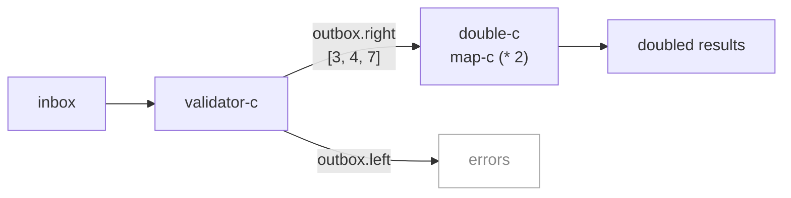
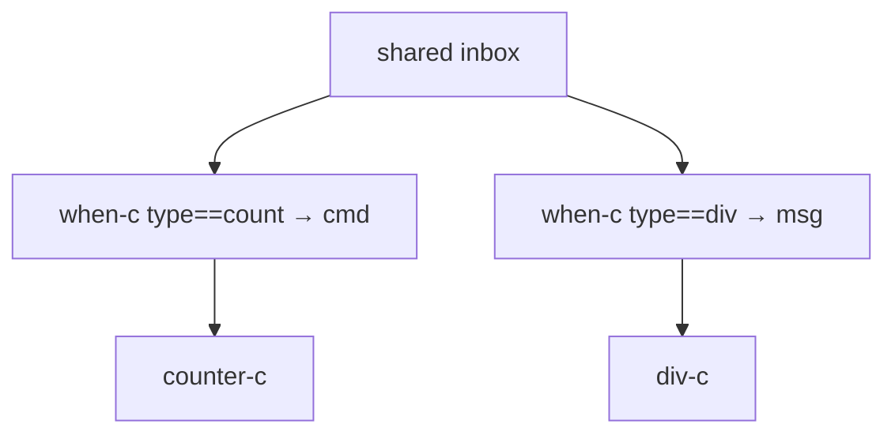

import { Aside } from '@astrojs/starlight/components';

## The pattern



## Validate → transform

```nix
inherit (dnzl) actor reply;
inherit (dnzl.ned) st map-c;

validator = n:
  if n > 0 then reply.right n
  else reply.left "non-positive: ${toString n}";

validator-c = actor validator;
double-c    = map-c (n: n * 2);   # stream transformer, not a cycle-c

validated = validator-c { inbox = st 3 (-1) 4 0 7; };
# outbox.right = ST [3, 4, 7] — bare values, tags stripped
doubled = double-c validated.outbox.right;
doubled.toList
# → [ 6 8 14 ]
```

`outbox.right` yields bare success values — no `{ right = n }` wrapper to unwrap.

<Aside type="note" title="See it in tests">
[`tests/examples.nix` — `pipeline.test-validate-then-double`](https://github.com/denful/dnzl/blob/main/tests/examples.nix)
</Aside>

## Counter chain

Two counters in series — each reply from A triggers one "inc" in B:

```nix
a = counter-c { inbox = st "inc" "inc" "inc"; };
b = counter-c { inbox = a.outbox.right (st.map (_: "inc")); };
b.outbox.toList
# → [ { right = 1; } { right = 2; } { right = 3; } ]
```

`a.outbox.right` is bare ints `[1, 2, 3]`. `st.map (_: "inc")` substitutes `"inc"` for each.

<Aside type="note" title="See it in tests">
[`tests/examples.nix` — `pipeline.test-counter-chain`](https://github.com/denful/dnzl/blob/main/tests/examples.nix)
</Aside>

## Type-based routing

Split one inbox across multiple actors by message type using `when-c`:

```nix
inherit (dnzl.ned) when-c;

inbox =
  st
    { type = "count"; cmd = "inc"; }
    { type = "div"; dividend = 10; divisor = 2; }
    { type = "count"; cmd = "inc"; }
    { type = "div"; dividend = 9; divisor = 3; }
    { type = "count"; cmd = "get"; };

counts  = counter-c { inbox = when-c (m: m.type == "count") inbox (m: m.cmd); };
divides = div-c     { inbox = when-c (m: m.type == "div")   inbox (m: m);     };

# concat outboxes in order — counts first, then divides
(counts.outbox (divides.outbox)).toList
# → [ { right = 1; } { right = 2; } { right = 2; }
#     { right = 5; } { right = 3; } ]
```



<Aside type="note" title="See it in tests">
[`tests/examples.nix` — `routing.test-type-routing`](https://github.com/denful/dnzl/blob/main/tests/examples.nix)
</Aside>

## Fan-in with merge

```nix
inherit (dnzl) merge actor reply;

cmds-a = st "inc" "inc";
cmds-b = st "inc" "get";

shared = counter-c { inbox = merge [ cmds-a cmds-b ]; };
shared.outbox.toList
# → [ { right = 1; } { right = 2; } { right = 3; } { right = 3; } ]
```

`merge` concatenates in list order — all of `cmds-a` before `cmds-b`.

<Aside type="note" title="See it in tests">
[`tests/examples.nix` — `fan-in.test-shared-counter`](https://github.com/denful/dnzl/blob/main/tests/examples.nix), [`tests/patterns.nix` — `multi-sender.test-two-senders-shared-actor`](https://github.com/denful/dnzl/blob/main/tests/patterns.nix)
</Aside>

## Composite cycle

Wrap routing logic inside a named cycle-c:

```nix
# Caller sends typed envelopes; routing is hidden inside
typed-c =
  { inbox }:
  let
    counts  = counter-c { inbox = when-c (m: m ? cmd)      inbox (m: m.cmd); };
    divides = div-c     { inbox = when-c (m: m ? dividend) inbox (m: m);     };
  in
  { outbox = counts.outbox (divides.outbox); };

a = typed-c {
  inbox = st
    { cmd = "inc"; }
    { dividend = 10; divisor = 2; }
    { cmd = "get"; };
};
a.outbox.toList
# → [ { right = 1; } { right = 1; } { right = 5; } ]
```

<Aside type="note" title="See it in tests">
[`tests/examples.nix` — `composition.test-composite-cycle`](https://github.com/denful/dnzl/blob/main/tests/examples.nix)
</Aside>
