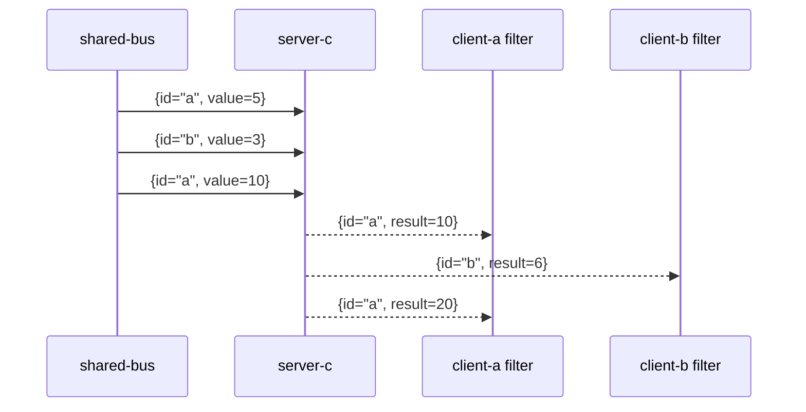
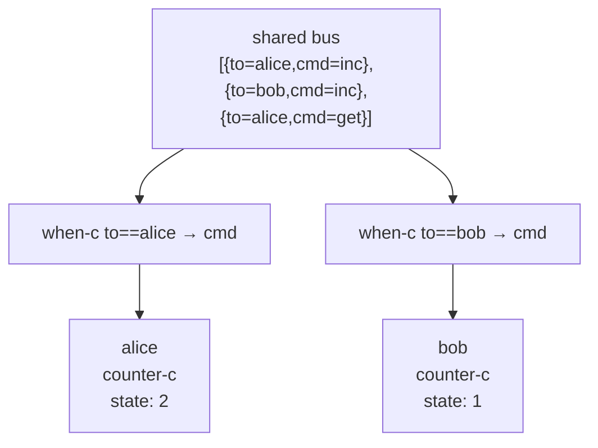

import { Aside } from '@astrojs/starlight/components';

## Problem

Multiple clients communicate with one server. How does each client receive only its own replies without building separate channels?

## Solution: tag replies with client id

The server tags each reply with the originating client id. Clients filter the shared outbox by their own id.



```nix
server-beh = msg: reply { id = msg.id; result = msg.value * 2; };
server-c = actor server-beh;

shared-bus =
  st
    { id = "a"; value = 5; }
    { id = "b"; value = 3; }
    { id = "a"; value = 10; };

server = server-c { inbox = shared-bus; };

client-a = server.outbox.filter (r: r.id == "a");
client-b = server.outbox.filter (r: r.id == "b");

client-a.toList
# [ { id = "a"; result = 10; } { id = "a"; result = 20; } ]
client-b.toList
# [ { id = "b"; result = 6; } ]
```

Each client sees only its slice. The server needs no routing logic — it just echoes the id back.

<Aside type="note" title="See it in tests">
[`tests/advanced.nix` — `private-channels.test-tagged-bus`](https://github.com/denful/dnzl/blob/main/tests/advanced.nix)
</Aside>

## With Either results

Combine the tagged bus with `reply.right` / `reply.left` for per-client error separation:

```nix
compute =
  msg:
  if msg.divisor == 0 then { left = "div-by-zero"; }
  else { right = msg.dividend / msg.divisor; };

server-c = actor (msg: reply { id = msg.id; result = compute msg; });

shared-bus =
  st
    { id = "a"; dividend = 10; divisor = 2; }
    { id = "b"; dividend = 6;  divisor = 0; }
    { id = "a"; dividend = 9;  divisor = 3; };

server = server-c { inbox = shared-bus; };

a-replies = server.outbox.filter (r: r.id == "a");
b-replies = server.outbox.filter (r: r.id == "b");
```

Each client gets `{ id, result }` where `result` is `{ right = n }` or `{ left = msg }`.

<Aside type="note" title="See it in tests">
[`tests/advanced.nix` — `private-channels.test-tagged-bus-with-errors`](https://github.com/denful/dnzl/blob/main/tests/advanced.nix)
</Aside>

## Alternative: isolated sessions via when-c

If clients want full per-client state (not just reply filtering), use `when-c` to give each client its own actor instance:



```nix
shared =
  st
    { to = "alice"; cmd = "inc"; }
    { to = "bob";   cmd = "inc"; }
    { to = "alice"; cmd = "get"; };

alice = counter-c { inbox = when-c (m: m.to == "alice") shared (m: m.cmd); };
bob   = counter-c { inbox = when-c (m: m.to == "bob")   shared (m: m.cmd); };
```

Alice and Bob each get their own counter state. Messages for one never affect the other.

<Aside type="note" title="See it in tests">
[`tests/advanced.nix` — `isolated-sessions.test-two-clients-independent-state`](https://github.com/denful/dnzl/blob/main/tests/advanced.nix)
</Aside>
