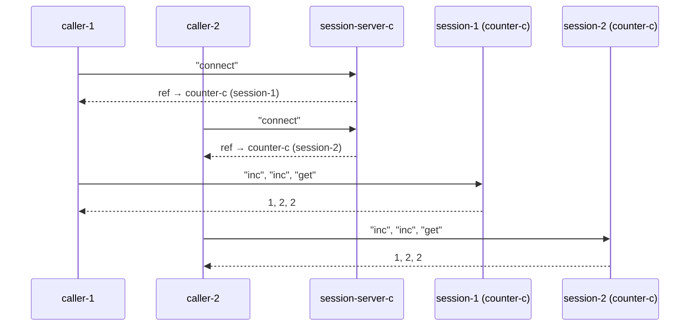

import { Aside } from '@astrojs/starlight/components';

## Concept

In dnzl, a cycle-c is a plain Nix value. It can be stored in attrsets, passed as arguments, and — crucially — returned as a reply. When a server returns a ref, the receiver gains the ability to communicate with that actor. Not holding the ref means no access. **The ref is the capability.**

## Server vending sessions



```nix
# Every "connect" request yields a fresh counter-c ref
session-server-c = actor (_: reply counter-c);

session-refs = (session-server-c { inbox = st "connect" "connect"; }).outbox;

# Each session ref is independent
sessions = session-refs.flatMap (ref: (ref { inbox = st "inc" "inc" "get"; }).outbox);
sessions.toList
# [ { right = 1; } { right = 2; } { right = 2; }   ← session 1
#   { right = 1; } { right = 2; } { right = 2; } ]  ← session 2
```

Both sessions start at zero. Using one session does not affect the other — there is no shared state.

<Aside type="note" title="See it in tests">
[`tests/advanced.nix` — `capability-refs.test-server-vends-sessions`](https://github.com/denful/dnzl/blob/main/tests/advanced.nix)
</Aside>

## Delegation

A party holding a ref can pass it to a third party. The third party can use it exactly like the original holder:

```nix
mediator = msg: send msg.ref (st msg.payload);
mediator-c = actor mediator;

a = mediator-c {
  inbox = st
    { ref = counter-c; payload = "inc"; }
    { ref = counter-c; payload = "inc"; }
    { ref = counter-c; payload = "get"; };
};

a.outbox.toList
# [ { right = 1; } { right = 1; } { right = 0; } ]
```

Each delegation creates a fresh session — the mediator can't tell it's been delegated to, and the original capability semantics are preserved.

<Aside type="note" title="See it in tests">
[`tests/advanced.nix` — `capability-refs.test-delegated-ref`](https://github.com/denful/dnzl/blob/main/tests/advanced.nix)
</Aside>

## Patterns enabled by capability refs

- **Attenuated capabilities**: return a wrapper ref that intercepts and filters messages before forwarding
- **Time-limited access**: return a ref that tracks usage state via `become`, denying access after N uses
- **Typed access**: vend different refs for read-only vs read-write operations (different behaviour functions)

All of these are just functions returning functions — no special machinery needed.
