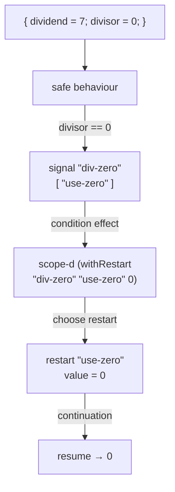

import { Aside } from '@astrojs/starlight/components';

## Pattern

Errors are a conversation, not a crash. On a bad input the behaviour does not
throw — it **signals** a named condition that offers one or more named
**restarts** and then waits. A handler policy installed at the world edge with
`scope-d` decides which restart to invoke; the behaviour **resumes** with the
value that restart carries. The behaviour never names a fallback — swap the
policy and the same behaviour recovers differently.



```nix
inherit (dnzl) ned fx actor reply;
inherit (ned) st scope-d;
inherit (fx) bind pure;

signal      = fx.effects.conditions.signal;
withRestart = fx.effects.conditions.withRestart;

# The behaviour signals on a zero divisor and resumes with the restart's
# value. It carries no fallback of its own.
safe = msg:
  reply (st (
    if msg.divisor == 0
    then bind (signal "div-zero" { inherit (msg) dividend; } [ "use-zero" ])
              (r: pure r.value)
    else pure (msg.dividend / msg.divisor)));

safe-c = actor safe;

# The world edge installs the recovery policy: when "div-zero" fires,
# invoke the "use-zero" restart with the value 0.
(scope-d (withRestart "div-zero" "use-zero" 0)
  (safe-c { inbox = st { dividend = 10; divisor = 2; }
                       { dividend = 7;  divisor = 0; }; }).outbox).toList
# => [ 5 0 ]
```

The signal does not unwind the actor. `signal "div-zero" … [ "use-zero" ]`
emits a condition effect that names the trouble and lists the restarts on
offer; the second message recovers as `0` instead of aborting the stream.

The handler **is** the algebra that chooses among the offered restarts.
`withRestart "div-zero" "use-zero" 0` is a tiny algebra: for the `div-zero`
condition it answers "invoke `use-zero`, with value `0`". `scope-d` resolves
every condition effect in the outbox against that algebra.

## Swap the policy, swap the recovery

`safe` is byte-for-byte the same. Only the world-edge handler changes — and
the recovery value changes with it:

```nix
(scope-d (withRestart "div-zero" "use-zero" 999)
  (safe-c { inbox = st { dividend = 10; divisor = 2; }
                       { dividend = 7;  divisor = 0; }; }).outbox).toList
# => [ 5 999 ]
```

Recovery is a property of the policy, not of the behaviour. The same condition
that recovered as `0` above now recovers as `999`, with no edit to `safe`. This
is the algebraic-effects encoding of Common-Lisp conditions: the behaviour
signals, the policy resumes, and the two stay independent.

<Aside type="note" title="See it in tests">
[`tests/conditions.nix` — `conditions.test-recover-zero`](https://github.com/denful/dnzl/blob/main/tests/conditions.nix)
and [`conditions.test-swap-policy`](https://github.com/denful/dnzl/blob/main/tests/conditions.nix)
</Aside>
