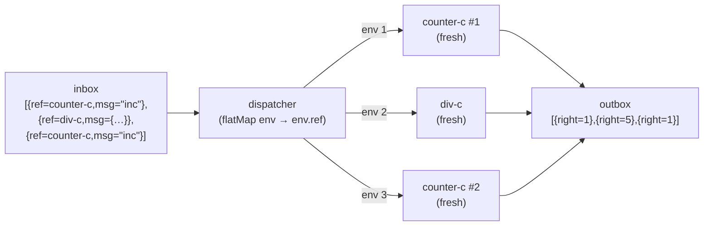

import { Aside } from '@astrojs/starlight/components';

## Pattern

The caller puts the target ref inside the message. The dispatcher unpacks it and calls it. No routing table needed — the caller chooses the actor.



```nix
dispatcher =
  { inbox }:
  { outbox = inbox.flatMap (env: (env.ref { inbox = st env.msg; }).outbox); };

a = dispatcher {
  inbox = st
    { ref = counter-c; msg = "inc"; }
    { ref = div-c;     msg = { dividend = 10; divisor = 2; }; }
    { ref = counter-c; msg = "inc"; };
};

a.outbox.toList
# [ { right = 1; } { right = 5; } { right = 1; } ]
```

Each envelope is independent. The two `counter-c` dispatches both start from a fresh counter — no shared state.

<Aside type="note" title="See it in tests">
[`tests/advanced.nix` — `dynamic-dispatch.test-ref-in-envelope`](https://github.com/denful/dnzl/blob/main/tests/advanced.nix)
</Aside>

## Multiple messages per envelope

Extend the envelope to carry a list of messages for one actor:

```nix
dispatcher =
  { inbox }:
  { outbox = inbox.flatMap (env: (env.ref { inbox = st.fromList env.msgs; }).outbox); };

a = dispatcher {
  inbox = st
    { ref = counter-c; msgs = [ "inc" "inc" "get" ]; }
    { ref = div-c; msgs = [ { dividend = 9; divisor = 3; } ]; }
    { ref = counter-c; msgs = [ "inc" "get" ]; };
};
```

Each envelope starts a fresh actor session. The first counter processes `inc inc get` → `1 2 2`. The second counter processes `inc get` fresh → `1 1`.

<Aside type="note" title="See it in tests">
[`tests/advanced.nix` — `dynamic-dispatch.test-heterogeneous-refs`](https://github.com/denful/dnzl/blob/main/tests/advanced.nix)
</Aside>

## Relationship to proxy

The [proxy pattern](/patterns/proxy/) is the actor-wrapped version of dynamic dispatch:

```nix
# Dynamic dispatch (plain cycle-c, no actor wrapper)
dispatcher = { inbox }:
  { outbox = inbox.flatMap (env: (env.ref { inbox = st env.msg; }).outbox); };

# Proxy (same logic, but as an actor behaviour)
proxy = msg: send msg.ref (st msg.data);
proxy-c = actor proxy;
```

Both create fresh sessions per message. The dispatcher pattern is more flexible (can batch messages); the proxy pattern is simpler when one message → one dispatch.
