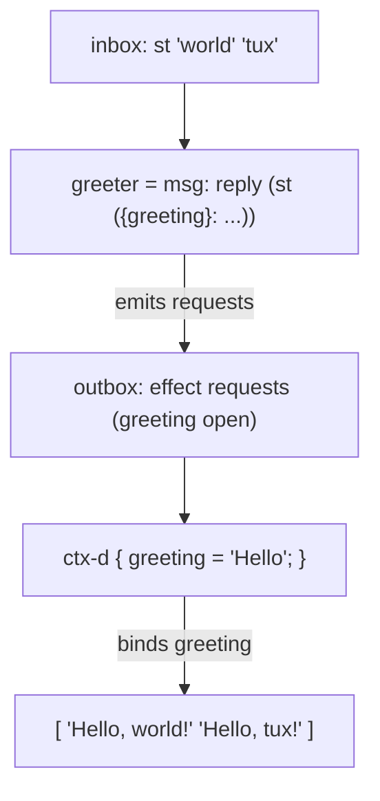

import { Aside } from '@astrojs/starlight/components';

## Pattern

A behaviour can **request** an effect instead of hard-coding a value: it names
the effect as a function argument and wraps the result in an ST. `st` over a
function-with-named-args becomes an effect *request* (`ctx-s`) — the value is
left open. The world edge resolves it with a `ctx-d` handler that binds each
requested name to a value.



```nix
inherit (dnzl) actor reply;
inherit (dnzl.ned) st ctx-d;

# greeter requests the effect `greeting` — it never decides the word.
greeter = msg: reply (st ({ greeting }: "${greeting}, ${msg}!"));
greeter-c = actor greeter;

# the edge picks the handler that supplies `greeting`.
out = ctx-d { greeting = "Hello"; } (greeter-c { inbox = st "world" "tux"; }).outbox;

out.toList
# => [ "Hello, world!" "Hello, tux!" ]
```

The behaviour stays pure and fully testable: it has no idea where `greeting`
comes from, so there is nothing to mock inside it. All the wiring lives at the
edge, in one place — the handler.

## Swap the handler, swap the deployment

Because the value is resolved at the edge, choosing a different `ctx-d` handler
changes the result without touching the behaviour. The same `greeter` now
greets differently:

```nix
ctx-d { greeting = "Hi"; } (greeter-c { inbox = st "world" "tux"; }).outbox
# => [ "Hi, world!" "Hi, tux!" ]
```

This is dependency injection — the reader pattern for actors. The handler is
the seam between **what** the behaviour computes and **which** environment it
runs against. A production handler and a mock handler are interchangeable: pick
prod at the edge for real runs, pick mock at the edge for tests.

## Multiple effects

A behaviour can request several effects at once by naming more arguments. The
message still flows through, so per-message data and injected environment
combine freely:

```nix
# connect requests `host` and `port`; the user comes from the message.
connect = user: reply (st ({ host, port }: "${user}@${host}:${toString port}"));
connect-c = actor connect;

# prod handler — real environment
ctx-d { host = "igloo"; port = 22; } (connect-c { inbox = st "tux" "root"; }).outbox
# => [ "tux@igloo:22" "root@igloo:22" ]

# mock handler — same behaviour, swapped environment for tests
ctx-d { host = "mock"; port = 0; } (connect-c { inbox = st "tux" "root"; }).outbox
# => [ "tux@mock:0" "root@mock:0" ]
```

Only the bindings differ between prod and mock; `connect` is byte-for-byte the
same behaviour in both. That is the whole point — the edge owns the
environment, the behaviour owns the logic.

<Aside type="note" title="See it in tests">
[`tests/effects.nix` — `effects.test-resolve`](https://github.com/denful/dnzl/blob/main/tests/effects.nix), [`effects.test-swap-handler`](https://github.com/denful/dnzl/blob/main/tests/effects.nix), and [`effects.test-mock-deployment`](https://github.com/denful/dnzl/blob/main/tests/effects.nix)
</Aside>
