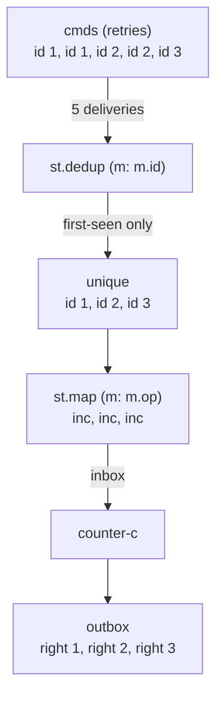

import { Aside } from '@astrojs/starlight/components';

## Pattern

Commands get retried. A client resends because it never saw the ack; a transport
redelivers the same message. Tag each command with a stable message id and run
the stream through `st.dedup (m: m.id)`: it drops every item whose key was
already seen and keeps the **first** occurrence. Retries collapse, so a stateful
counter downstream counts each command **at most once**.



```nix
inherit (dnzl) ned actor reply become;
inherit (ned) st;

counter = count: msg:
  if msg == "inc" then reply.right (count + 1) // become (counter (count + 1))
  else if msg == "get" then reply.right count
  else { };

counter-c = actor (counter 0);

# retried command log: id 1 twice, id 2 twice, id 3 once — 5 deliveries
cmds = st
  { id = 1; op = "inc"; } { id = 1; op = "inc"; }
  { id = 2; op = "inc"; } { id = 2; op = "inc"; }
  { id = 3; op = "inc"; };

unique = ned.st.dedup (m: m.id) cmds;   # collapse retries by message id
ops    = unique (st.map (m: m.op));     # extract op after dedup

(counter-c { inbox = ops; }).outbox.toList
# => [ { right = 1; } { right = 2; } { right = 3; } ]
#    3 unique ids applied — not 5
```

`dedup` keeps the first occurrence of each key and preserves arrival order, so a
late retry carrying a stale payload is discarded in favour of what was seen
first. Idempotent delivery falls out for free: the counter advances once per
distinct command id, no matter how many times the transport redelivers it.

## Without dedup — the bug it prevents

Feed the **same** commands straight through and every retry is applied. The
counter over-counts to 5:

```nix
ops = cmds (st.map (m: m.op));          # no dedup

(counter-c { inbox = ops; }).outbox.toList
# => [ { right = 1; } { right = 2; } { right = 3; } { right = 4; } { right = 5; } ]
#    every duplicate counted — at-least-once, not at-most-once
```

The deduped count is the source of truth. Append a trailing `"get"` after the
unique increments and it reads `3`, not `5` — proof the retries left no trace:

```nix
ops-with-get = (unique (st.map (m: m.op))) (st "get");

(counter-c { inbox = ops-with-get; }).outbox.toList
# => [ { right = 1; } { right = 2; } { right = 3; } { right = 3; } ]
#    get → 3 unique commands
```

<Aside type="note" title="See it in tests">
[`tests/idempotency.nix` — `idempotency.test-dedup-collapses-retries`](https://github.com/denful/dnzl/blob/main/tests/idempotency.nix)
</Aside>
