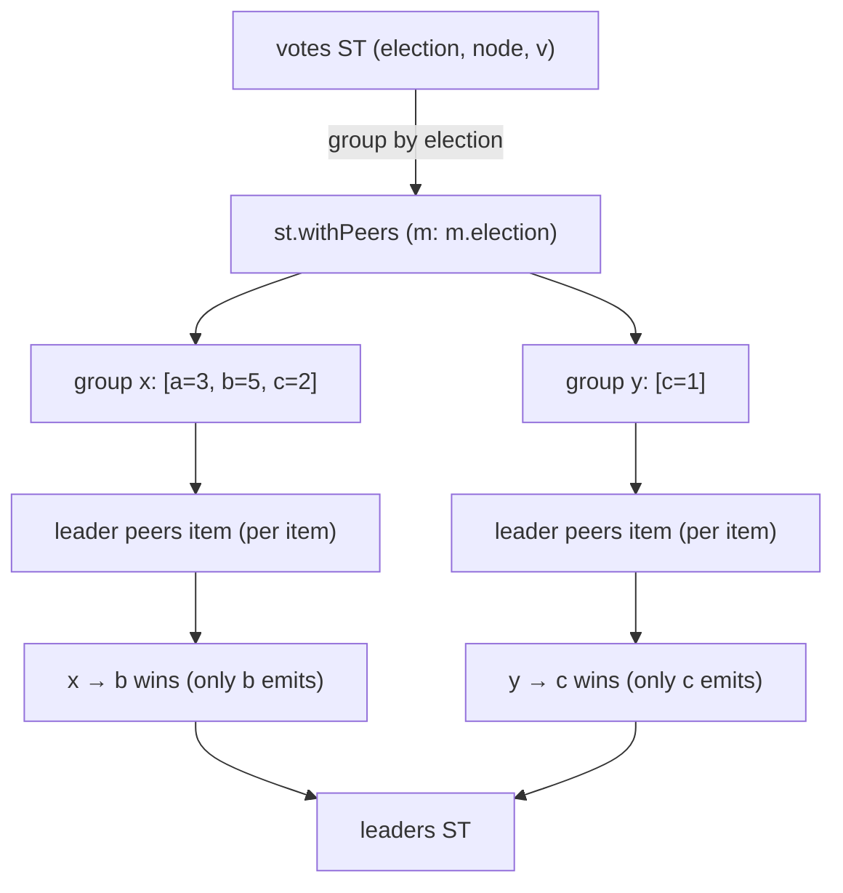

import { Aside } from '@astrojs/starlight/components';

## Pattern

`st.withPeers key-fn f source` groups `source` by `key-fn`, then for every item
calls `f peers item` where `peers` is the **whole group** that item belongs to.
Each item sees its siblings — this is *relational* grouping.

Leader election falls out directly: group votes by election id, and within each
group pick the highest-vote node. To collapse a group to a single row, the
behaviour emits only for the winning item (`st { ... }`) and the empty stream
(`st`) for everyone else.



```nix
inherit (dnzl) ned;
inherit (ned) st;

votes = st
  { election = "x"; node = "a"; v = 3; }
  { election = "x"; node = "b"; v = 5; }
  { election = "y"; node = "c"; v = 1; }
  { election = "x"; node = "c"; v = 2; };

# f :: [vote] -> vote -> ST leader-row
# `peers` is the full group; only the winner emits → one row per election.
leader = peers: m:
  let winner = builtins.head (builtins.sort (p: q: p.v > q.v) peers);
  in if m.node == winner.node
     then st { inherit (m) election; leader = winner.node; votes = winner.v; }
     else st;

(st.withPeers (m: m.election) leader votes).toList
# => [ { election = "x"; leader = "b"; votes = 5; }
#      { election = "y"; leader = "c"; votes = 1; } ]
```

Each vote is handed the entire slate of its election, so the group can agree on
a single winner. Groups appear in key order (`x` before `y`); within a group,
members keep source order.

## Relational, not per-item

This is what sets `withPeers` apart from `when-c` routing. With `when-c`, a
message only ever sees *itself* — it is matched and forwarded in isolation, so a
decision can never depend on the other messages in the stream. `withPeers` gives
each item its whole group, so the behaviour can compare siblings: pick a maximum,
count voters, check a quorum, deduplicate against neighbours.

Because `f` runs once per item, emitting `st` (empty) for non-winners is the
idiom for "one row per group". Emit for every item instead, and you get a
group-annotated stream — each item can read `builtins.length peers` to learn how
many siblings it has:

```nix
tag = peers: m: st { v = m.v; peers = builtins.length peers; };

(st.withPeers (m: m.election) tag votes).toList
# => [ { peers = 3; v = 3; }
#      { peers = 3; v = 5; }
#      { peers = 3; v = 2; }
#      { peers = 1; v = 1; } ]
```

<Aside type="note" title="See it in tests">
[`tests/leader-election.nix` — `leader-election.test-multiple-elections`](https://github.com/denful/dnzl/blob/main/tests/leader-election.nix)
</Aside>

## Quorum

Because the decision can read the group, a leader can require a minimum number of
voters. The winner emits only when its peer group is large enough — small groups
are dropped:

```nix
quorum = peers: m:
  let winner = builtins.head (builtins.sort (p: q: p.v > q.v) peers);
  in if m.node == winner.node && builtins.length peers >= 3
     then st { inherit (m) election; leader = winner.node; quorum = builtins.length peers; }
     else st;

(st.withPeers (m: m.election) quorum votes).toList
# => [ { election = "x"; leader = "b"; quorum = 3; } ]
```

Election `x` has three voters and elects `b`; election `y` has a single lone
vote and produces nothing. Per-item routing cannot express this — the outcome
depends on how many siblings the item has.

<Aside type="note" title="See it in tests">
[`tests/leader-election.nix` — `leader-election.test-quorum`](https://github.com/denful/dnzl/blob/main/tests/leader-election.nix)
</Aside>
