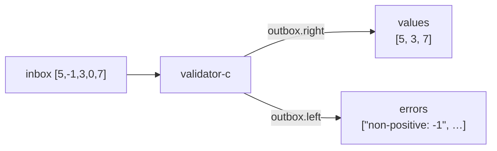
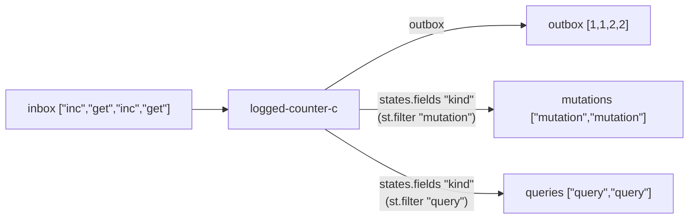

import { Aside } from '@astrojs/starlight/components';

## Named outputs

A cycle-c can return any attrset. Return multiple named streams instead of a single `outbox`:



```nix
validate-c =
  { inbox }:
  let a = validator-c { inherit inbox; };
  in {
    values = a.outbox.right;
    errors = a.outbox.left;
  };

result = validate-c { inbox = st 5 (-1) 3 0 7; };
result.values.toList
# [ 5 3 7 ]
result.errors.toList
# [ "non-positive: -1" "non-positive: 0" ]
```

Callers access named outputs directly without knowing about Either internals.

<Aside type="note" title="See it in tests">
[`tests/patterns.nix` — `multi-output-cycle.test-named-outputs`](https://github.com/denful/dnzl/blob/main/tests/patterns.nix)
</Aside>

## Side-channel state with states.fields

Behaviours can set extra fields that don't appear in `outbox`. The `states` stream carries all per-message state, and `states.fields "key"` extracts any field:



```nix
logged-counter =
  count: msg:
  if msg == "inc" then
    reply.right (count + 1) // { kind = "mutation"; } // become (logged-counter (count + 1))
  else if msg == "get" then
    reply.right count // { kind = "query"; }
  else
    { };

lc = actor (logged-counter 0);

lc-c =
  { inbox }:
  let a = lc { inherit inbox; };
  in {
    mutations = a.states.fields "kind" (st.filter (k: k == "mutation"));
    queries   = a.states.fields "kind" (st.filter (k: k == "query"));
    outbox    = a.outbox;
  };

result = lc-c { inbox = st "inc" "get" "inc" "get"; };
result.mutations.toList  # [ "mutation" "mutation" ]
result.queries.toList    # [ "query" "query" ]
```

`states.fields "kind"` extracts the `kind` field from each state into a `ST`. Applying `st.filter` to it filters by value.

<Aside type="note" title="See it in tests">
[`tests/patterns.nix` — `multi-output-cycle.test-stateful-multi-output`](https://github.com/denful/dnzl/blob/main/tests/patterns.nix)
</Aside>

## Audit log pattern

Use an extra field to build an audit log alongside normal output:

```nix
logged-div =
  msg:
  if msg.divisor == 0 then
    { reply = { left = "div-by-zero"; }; log = "error: div-by-zero"; }
  else
    { reply = { right = msg.dividend / msg.divisor; }; log = "ok: ${toString (msg.dividend / msg.divisor)}"; };

a = (actor logged-div) { inbox = st { dividend = 10; divisor = 2; }
                                     { dividend = 5;  divisor = 0; }; };

a.outbox.toList                  # [ { right = 5; } { left = "div-by-zero"; } ]
(a.states.fields "log").toList   # [ "ok: 5" "error: div-by-zero" ]
```

<Aside type="note" title="See it in tests">
[`tests/examples.nix` — `extra-outputs.test-audit-log`](https://github.com/denful/dnzl/blob/main/tests/examples.nix)
</Aside>
