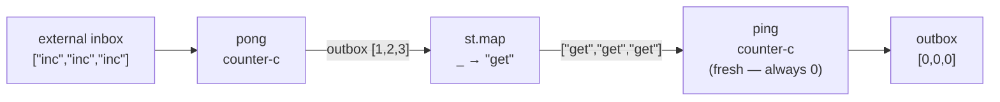
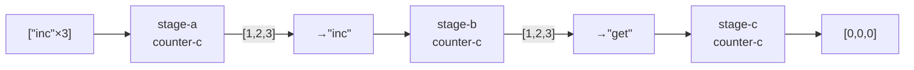

import { Aside } from '@astrojs/starlight/components';

## The pattern

Two actors in a lazy `let`: the second actor's inbox depends on the first actor's outbox. Nix laziness resolves the order.



```nix
ping-pong-c =
  { inbox }:
  let
    pong = counter-c { inherit inbox; };
    ping = counter-c { inbox = pong.outbox (st.map (_: "get")); };
  in
  { outbox = ping.outbox; };

result = ping-pong-c { inbox = st "inc" "inc" "inc"; };
result.outbox.toList
# [ { right = 0; } { right = 0; } { right = 0; } ]
```

`pong` processes the external seed inbox and produces 3 replies. `st.map (_: "get")` transforms each reply — discarding the value — into the string `"get"`. `ping` receives those three `"get"` messages. Since `ping` is a fresh counter starting at 0 and `"get"` never increments, it returns `{ right = 0 }` each time.

No circularity: `ping` depends on `pong`; `pong` does not depend on `ping`.

<Aside type="note" title="See it in tests">
[`tests/patterns.nix` — `ping-pong.test-pong-feeds-ping`](https://github.com/denful/dnzl/blob/main/tests/patterns.nix)
</Aside>

## Three-stage pipeline

Extend the lazy-let pattern to N stages:



```nix
stage-a = counter-c { inbox = st "inc" "inc" "inc"; };
stage-b = counter-c { inbox = stage-a.outbox (st.map (_: "inc")); };
stage-c = counter-c { inbox = stage-b.outbox (st.map (_: "get")); };

stage-c.outbox.toList
# [ { right = 0; } { right = 0; } { right = 0; } ]
```

- `stage-a` gets `["inc","inc","inc"]` → outbox `[{right=1},{right=2},{right=3}]`
- `stage-b` gets `["inc","inc","inc"]` (each stage-a reply mapped to `"inc"`) → outbox `[{right=1},{right=2},{right=3}]`
- `stage-c` gets `["get","get","get"]` (each stage-b reply mapped to `"get"`) — counter starts at 0, `"get"` never increments → `[{right=0},{right=0},{right=0}]`

<Aside type="note" title="See it in tests">
[`tests/patterns.nix` — `ping-pong.test-three-stage-lazy`](https://github.com/denful/dnzl/blob/main/tests/patterns.nix)
</Aside>

## Why no circularity

The key insight: a dependency graph is fine as long as it is acyclic. Lazy `let` in Nix allows forward references — you can reference `pong.outbox` before `pong` is evaluated, because Nix only evaluates `pong` when its value is needed. Since `pong` does not depend on `ping`, there is a valid evaluation order.

A **true** cycle (actor A's outbox feeds A's own inbox, producing more output) would diverge. dnzl's design avoids this: feedback loops must terminate (see [Lazy Evaluation](/explanation/lazy-evaluation/)).
