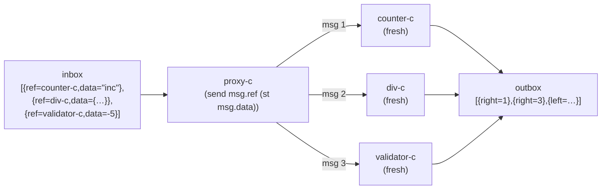

import { Aside } from '@astrojs/starlight/components';

## Proxy pattern

Each message carries its own destination ref and a datum. The proxy forwards datum → ref:



```nix
proxy = msg: send msg.ref (st msg.data);
proxy-c = actor proxy;

a = proxy-c {
  inbox = st
    { ref = counter-c; data = "inc"; }
    { ref = div-c;     data = { dividend = 12; divisor = 4; }; }
    { ref = validator-c; data = (-5); };
};

a.outbox.toList
# [ { right = 1; } { right = 3; } { left = "non-positive: -5"; } ]
```

Each dispatch is a fresh session — `send` creates a new actor per call. No shared state between messages.

<Aside type="note" title="See it in tests">
[`tests/patterns.nix` — `proxy.test-proxy-forwards`](https://github.com/denful/dnzl/blob/main/tests/patterns.nix), [`proxy.test-proxy-heterogeneous`](https://github.com/denful/dnzl/blob/main/tests/patterns.nix)
</Aside>

## Delegation

`send` is the delegation primitive. It forwards a stream to a ref and returns that ref's outbox as the reply:

```nix
forwarder = msg: send msg.ref (st msg.payload);
forwarder-c = actor forwarder;
```

The forwarder doesn't need to know anything about the ref's internals — it just routes and collects.

<Aside type="note" title="See it in tests">
[`tests/examples.nix` — `delegation.test-fresh-per-message`](https://github.com/denful/dnzl/blob/main/tests/examples.nix), [`delegation.test-batch-send`](https://github.com/denful/dnzl/blob/main/tests/examples.nix), [`delegation.test-dispatch`](https://github.com/denful/dnzl/blob/main/tests/examples.nix)
</Aside>

## Capability refs

A capability ref is a cycle-c returned as a reply value. Holding the ref is the permission — callers who receive it can invoke the actor; callers who don't cannot.

```nix
# Server vends fresh counter sessions on connect
session-server-c = actor (_: reply counter-c);

session-refs = (session-server-c { inbox = st "connect" "connect"; }).outbox;

# Each ref is independent — use them however you like
sessions = session-refs.flatMap (ref: (ref { inbox = st "inc" "inc" "get"; }).outbox);
sessions.toList
# [ { right = 1; } { right = 2; } { right = 2; }
#   { right = 1; } { right = 2; } { right = 2; } ]
```

Both sessions start fresh — the server creates a new `counter-c` for each connect request.

<Aside type="note" title="See it in tests">
[`tests/advanced.nix` — `capability-refs.test-server-vends-sessions`](https://github.com/denful/dnzl/blob/main/tests/advanced.nix), [`capability-refs.test-delegated-ref`](https://github.com/denful/dnzl/blob/main/tests/advanced.nix)
</Aside>

## Ref in envelope (dynamic dispatch)

The ref doesn't have to be a fixed actor — it can vary per message, selected by the caller:

```nix
dispatcher =
  { inbox }:
  { outbox = inbox.flatMap (env: (env.ref { inbox = st env.msg; }).outbox); };

a = dispatcher {
  inbox = st
    { ref = counter-c; msg = "inc"; }
    { ref = div-c; msg = { dividend = 10; divisor = 2; }; }
    { ref = counter-c; msg = "inc"; };
};

a.outbox.toList
# [ { right = 1; } { right = 5; } { right = 1; } ]
```

Each `counter-c` call is a fresh session — no state carries across the two counter dispatches.

<Aside type="note" title="See it in tests">
[`tests/advanced.nix` — `dynamic-dispatch.test-ref-in-envelope`](https://github.com/denful/dnzl/blob/main/tests/advanced.nix)
</Aside>
