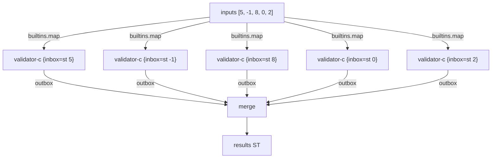

import { Aside } from '@astrojs/starlight/components';

## Pattern

Scatter: spawn one actor per input using `builtins.map`.
Gather: collect all outboxes into one stream using `merge`.



```nix
inherit (dnzl) merge actor reply;
inherit (dnzl.ned) st;

validator = n:
  if n > 0 then reply.right n
  else reply.left "non-positive: ${toString n}";

validator-c = actor validator;

inputs = [ 5 (-1) 8 0 2 ];
actors = builtins.map (n: validator-c { inbox = st n; }) inputs;
results = merge (builtins.map (a: a.outbox) actors);

results.toList
# [ { right = 5; }
#   { left = "non-positive: -1"; }
#   { right = 8; }
#   { left = "non-positive: 0"; }
#   { right = 2; } ]
```

Results appear in input order because `merge` concatenates streams in list order. Each actor is independent — no shared state.

<Aside type="note" title="See it in tests">
[`tests/advanced.nix` — `scatter-gather.test-validate-many`](https://github.com/denful/dnzl/blob/main/tests/advanced.nix)
</Aside>

## Gather successes only

Apply `.right` after merge to collect only the successful results:

```nix
all = merge (builtins.map (a: a.outbox) actors);
all.right.toList
# [ 5 8 2 ]
```

<Aside type="note" title="See it in tests">
[`tests/advanced.nix` — `scatter-gather.test-gather-successes`](https://github.com/denful/dnzl/blob/main/tests/advanced.nix)
</Aside>

## Heterogeneous scatter

Different actors for different inputs — the pattern is the same:

```nix
ops = [
  { ref = validator-c; input = 5; }
  { ref = div-c;       input = { dividend = 10; divisor = 2; }; }
  { ref = validator-c; input = (-3); }
];

actors  = builtins.map (op: op.ref { inbox = st op.input; }) ops;
results = merge (builtins.map (a: a.outbox) actors);
```

Each actor processes its own slice in isolation. The caller chooses which ref handles each input.
