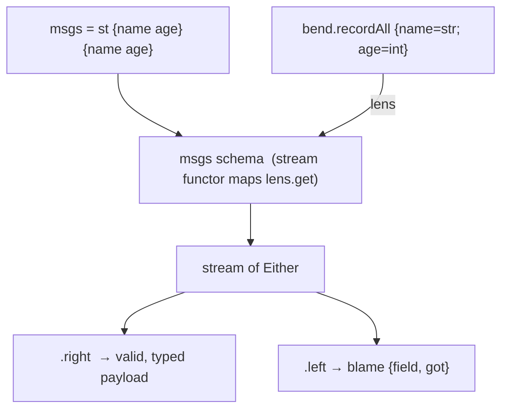

import { Aside } from '@astrojs/starlight/components';

## Pattern

A `bend` schema is a `{ get, set }` lens. Applying it to a stream maps
`lens.get` over every element, turning the stream into a stream of `Either`:
valid messages become `{ right = ... }`, invalid ones `{ left = ... }` carrying
blame. `.right` / `.left` then split successes from failures.



```nix
inherit (dnzl) ned bend;
inherit (ned) st;

# Each message must carry a string `name` and an int `age`.
schema = bend.recordAll { name = bend.str; age = bend.int; };

msgs = st
  { name = "alice"; age = 30; }      # valid
  { name = "bob";   age = "oops"; }; # age is not an int

validated = msgs schema; # functor sees a lens → stream of Either

{ ok = validated.right.toList; bad = validated.left.toList; }
# => { ok  = [ { right = { name = "alice"; age = 30; }; } ];
#      bad = [ { left = { name = { right = "bob"; };
#                         age  = { left = { field = "age"; got = "oops"; }; }; }; } ]; }
```

Validation **is** parsing. A valid message comes back as a typed `right` holding
the rebuilt record, so downstream actors receive a clean payload — never a raw,
unchecked attrset. An invalid message comes back as a `left` whose blame names
exactly which field failed and what was got.

`recordAll` collects **all** field errors at once rather than stopping at the
first: a message bad in two fields reports both, each as `{ left = { field; got; } }`.

The whole `bend` lens layer — `recordAll`, `str`, `int`, `nonBlank`, `optional`,
and the rest — plugs straight into the stream. Any `{ get, set }` lens works:
the functor detects the lens protocol and applies `lens.get` per element, so
schema validation is just another stream stage.

<Aside type="note" title="See it in tests">
[`tests/validation.nix` — `validation.test-invalid-is-blamed`](https://github.com/denful/dnzl/blob/main/tests/validation.nix)
</Aside>

## Collecting every error

Because `recordAll` validates every field, one message can surface several
blames in a single `left`:

```nix
bad = st { name = 7; age = "oops"; } schema;
bad.left.toList
# => [ { left = { name = { left = { field = "name"; got = 7; }; };
#                 age  = { left = { field = "age";  got = "oops"; }; }; }; } ]
```

<Aside type="note" title="See it in tests">
[`tests/validation.nix` — `validation.test-collects-all-errors`](https://github.com/denful/dnzl/blob/main/tests/validation.nix)
</Aside>
