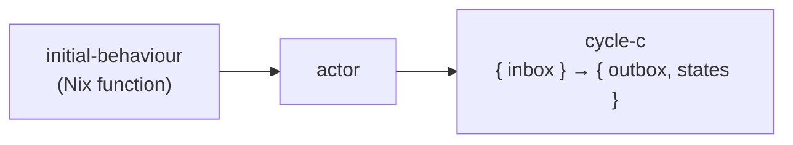

import { Aside } from '@astrojs/starlight/components';

## Signature

```nix
actor : behaviour → cycle-c
# where
#   behaviour = state → msg → { reply?, next-behaviour?, ...extras }
#   cycle-c   = { inbox: ST } → { outbox: ST, states: ST }
```

## Description

`actor initial-behaviour` returns a **cycle-c** — a function that takes `{ inbox }` and returns `{ outbox, states }`.



Internally, `actor` runs `scanl` over the inbox stream. Each message is passed to the current behaviour; the result is used to:
1. Extract `next-behaviour` (if present) as the behaviour for the next message
2. Carry all other result fields into the accumulated state

`outbox` is `states.fields "reply"` — the `reply` field from each state, flattened into a stream.

## Parameters

| Parameter | Type | Description |
|---|---|---|
| `initial-behaviour` | `state → msg → attrset` | The first behaviour to run. Subsequent behaviours come from `become`. |
| `inbox` | `ST` | Stream of messages to process. |

## Return value

| Field | Type | Description |
|---|---|---|
| `outbox` | `ST` | Stream of `reply` values from each message that produced one. |
| `states` | `ST` | Full scanl output — one state per message plus the initial state. |

## Behaviour return fields

| Field | Effect |
|---|---|
| `reply` | Value placed in `outbox`. May be a plain value or a `ST` (flattened). |
| `next-behaviour` | Replaces the current behaviour for the next message. |
| Any other field | Passes through to `states`. Accessible via `states.fields "fieldname"`. |

## Examples

**Stateless actor:**
```nix
echo-c = actor (msg: reply msg);
(echo-c { inbox = st "a" "b"; }).outbox.toList
# [ "a" "b" ]
```

**Stateful actor:**
```nix
counter = count: msg:
  if msg == "inc" then reply.right (count + 1) // become (counter (count + 1))
  else if msg == "get" then reply.right count
  else { };

counter-c = actor (counter 0);
(counter-c { inbox = st "inc" "inc" "get"; }).outbox.toList
# → [ { right = 1; } { right = 2; } { right = 2; } ]
```

**Fan-out (ST reply):**
```nix
expander-c = actor (msg: reply (st msg msg));
(expander-c { inbox = st "a" "b"; }).outbox.toList
# [ "a" "a" "b" "b" ]
```

<Aside type="note" title="See it in tests">
[`tests/actor.nix` — `test-counter`](https://github.com/denful/dnzl/blob/main/tests/actor.nix), [`test-become`](https://github.com/denful/dnzl/blob/main/tests/actor.nix), [`tests/examples.nix` — `fan-out.test-expander`](https://github.com/denful/dnzl/blob/main/tests/examples.nix)
</Aside>
