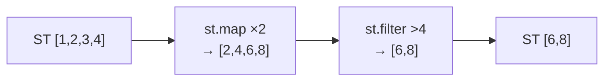

import { Aside } from '@astrojs/starlight/components';

## Stream functor dispatch

`ST` is a functor. Calling a stream as a function dispatches on the argument type:

| Argument | Result |
|---|---|
| Another `ST` | Concatenate |
| No-arg function (combinator) | Apply combinator to self |
| Any value | Append singleton |

The combinator form — `stream (st.map f)` — applies `st.map f` in-place, returning a transformed stream.

## st.map

Transform each element:

```nix
(st 1 2 3) (st.map (x: x * 10))
# → ST [10 20 30]
```

Equivalent to `map-c f stream`.

<Aside type="note" title="See it in tests">
[`tests/patterns.nix` — `st-combinators.test-map-combinator`](https://github.com/denful/dnzl/blob/main/tests/patterns.nix)
</Aside>

## st.filter

Keep elements matching a predicate:

```nix
(st 1 2 3 4 5) (st.filter (x: x > 3))
# → ST [4 5]
```

Equivalent to filtering with `when-c`.

<Aside type="note" title="See it in tests">
[`tests/patterns.nix` — `st-combinators.test-filter-combinator`](https://github.com/denful/dnzl/blob/main/tests/patterns.nix)
</Aside>

## Chaining

Apply multiple combinators in sequence:



```nix
(st 1 2 3 4) (st.map (x: x * 2)) (st.filter (x: x > 4))
# → ST [6 8]
```

<Aside type="note" title="See it in tests">
[`tests/patterns.nix` — `st-combinators.test-map-then-filter`](https://github.com/denful/dnzl/blob/main/tests/patterns.nix)
</Aside>

## st.flatMap

Map and flatten — each element can produce zero or more outputs:

```nix
(st 1 2 3) (st.flatMap (x: st x x))
# → ST [1 1 2 2 3 3]
```

<Aside type="note" title="See it in tests">
[`tests/patterns.nix` — `st-combinators.test-flatmap-combinator`](https://github.com/denful/dnzl/blob/main/tests/patterns.nix)
</Aside>

## st.scanl

Running fold that emits the accumulator at every step, including the initial value:

```nix
(st 1 2 3 4) (st.scanl (acc: x: acc + x) 0)
# → ST [0 1 3 6 10]
# initial=0, then 0+1=1, 1+2=3, 3+3=6, 6+4=10
```

`scanl` emits the initial accumulator first, then one value per element — so N elements produce N+1 outputs.

<Aside type="note" title="See it in tests">
[`tests/patterns.nix` — `st-combinators.test-scanl-combinator`](https://github.com/denful/dnzl/blob/main/tests/patterns.nix)
</Aside>

## Other ST methods

| Method | Description |
|---|---|
| `.toList` | Evaluate stream to a Nix list |
| `.filter pred` | Filter elements (same as `st.filter` combinator) |
| `.flatMap f` | Map and flatten |
| `.right` | Filter to elements with a `right` field |
| `.left` | Filter to elements with a `left` field |
| `st.fromList list` | Convert Nix list to stream |
| `st.flatten stream-of-streams` | Flatten one level |
| `fields "key"` | Extract a field from each element, flatten ST values |
